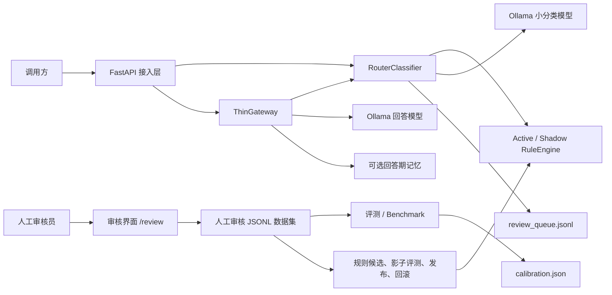
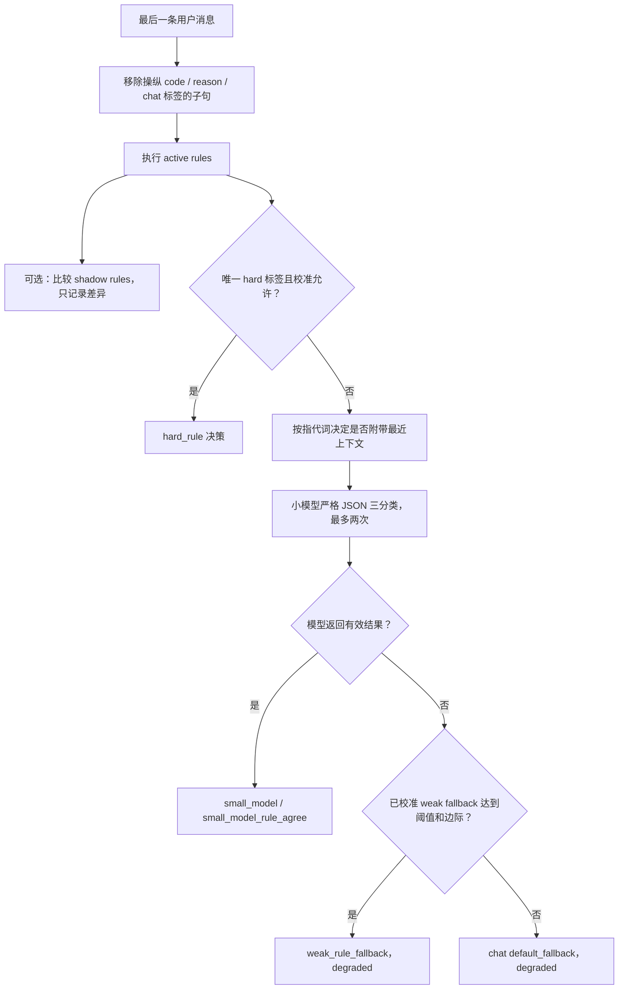
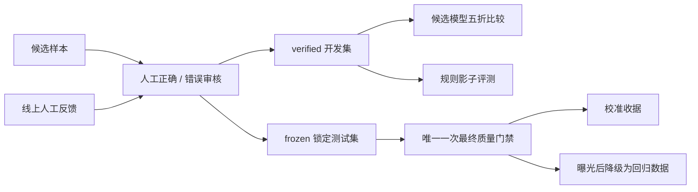

# AI Router 代码架构总结

> 本文基于当前仓库代码整理，重点回答系统如何分层、一次请求如何完成路由、
> 规则和模型如何协作、离线质量闭环如何约束线上行为，以及下一阶段应优先演进什么。
> 公开发布树已移除历史 `legacy/` 实现；可复现 baseline 仅保留必要规则配置。

## 1. 架构结论

这个项目当前是一个**本地、单进程、三分类的混合式 AI Router**。它对外同时提供
独立分类接口、OpenAI Chat Completions 兼容接口和 Ollama Chat 兼容接口，对内把
请求固定划分为 `code`、`reason`、`chat`，再映射到不同的回答模型。

它并不是一个依靠大模型自由选择后端的黑盒代理。真正的核心是一个受校准和发布
闸门约束的决策链：

1. 高精度 hard rule 在满足校准条件时短路。
2. weak rule 只向小模型提供辅助证据，不在正常链路中直接夺取决策权。
3. 剩余请求由本地小模型输出严格的三分类 JSON。
4. 分类模型不可用时，只允许通过已校准的 weak-rule 阈值降级；否则显式回退
   `chat` 并标记 `degraded=true`。
5. Thin Gateway 根据路由标签选择回答模型，完成协议转换、流式转发和错误映射。

从代码形态看，系统已经具备较完整的**在线请求面、离线评测面和规则治理面**，但
部署边界仍是面向单机的：FastAPI、分类器、Gateway、人工审核界面和本地文件存储
都装配在同一个进程中，Ollama 是唯一外部推理依赖。

## 2. 系统边界与总体结构



系统可以按职责分为五层：

| 层 | 主要模块 | 职责 |
|---|---|---|
| 应用装配层 | `router/app.py`、`router/api/runtime.py` | lifespan、安全中间件、显式依赖容器与 router 装配 |
| HTTP 分区层 | `router/api/inference.py`、`control.py`、`health.py` | 推理/兼容协议、反馈/审核、健康检查/指标，保持单进程部署 |
| 路由决策层 | `router/classifier.py`、`router/rules.py`、`router/prompting.py`、`router/normalization.py`、`router/calibration.py` | Prompt 工件、归一化、规则证据、小模型分类、校准、降级与影子差异记录 |
| 模型访问与转发层 | `router/gateway.py`、`router/ollama.py` | 路由到回答模型、工具模型覆盖、Ollama HTTP 调用与流式连接 |
| 数据与可观测层 | `router/storage.py`、`router/observability.py`、`router/review_ui.py` | JSONL 存储、显式记忆、Prometheus 指标、结构化日志、人工复核 |
| 离线治理层 | `router/evaluation.py`、`router/benchmark.py`、`router/rule_lifecycle.py`、`router/cli.py` | 数据校验、质量门禁、候选模型比较、校准写入、规则发布与回滚 |

底层公共契约集中在 `router/types.py` 和 `router/settings.py`：前者定义路由标签、
请求和决策对象，后者负责严格、冻结的配置加载及环境变量覆盖。

## 3. 在线请求架构

### 3.1 进程装配

`create_app()` 在启动时一次性创建并共享以下对象：

```text
Settings
  ├─ OllamaClient
  ├─ RouterClassifier
  │    ├─ active RuleEngine
  │    ├─ optional shadow RuleEngine
  │    ├─ ConfidenceCalibrator
  │    └─ review SecureJsonlStore
  ├─ ThinGateway
  ├─ feedback SecureJsonlStore
  └─ ReviewDatasetStore
```

这些对象被封装为不可变的 `RuntimeServices`，显式传入 inference、control 和 health
三个 router factory；各 HTTP 模块不创建模块级服务全局变量。这样在不增加新端口、
新容器或部署复杂度的前提下，先形成了推理面与审核/控制面的代码依赖边界。

当 `strict_model_check=true` 时，FastAPI lifespan 会在服务接受流量前检查所有配置
模型是否已安装，并把实际 Ollama digest 与校准收据绑定。规则、Prompt digest、
校准和影子报告也在对象初始化时加载，因此相关文件变化需重启进程后生效。

### 3.2 API 面

| 接口 | 作用 | 关键行为 |
|---|---|---|
| `POST /route` | 只做分类 | 返回完整 `RouteDecision`，不调用回答模型 |
| `POST /route/feedback` | 保存人工反馈 | 附加当前规则命中、版本和规则信号，不自动修改规则 |
| `POST /v1/chat/completions` | OpenAI 兼容入口 | 支持非流式与 SSE；实际模型由 Router 决定 |
| `POST /api/chat` | Ollama 兼容入口 | 支持非流式与 NDJSON 流式转发 |
| `POST /ask` | 旧兼容入口 | 带弃用和 sunset 响应头 |
| `GET /v1/models` | 暴露公共模型 ID | 只暴露配置中的逻辑模型 `local-router` |
| `GET /health/live` | 存活检查 | 不访问模型服务 |
| `GET /health/ready` | 就绪检查 | 校验模型、规则、校准和影子规则状态 |
| `GET /metrics` | Prometheus 指标 | 暴露请求、路由、上游、流式连接等指标 |
| `/review*` | 本地人工审核 | 不进入公开 OpenAPI schema |

OpenAI 请求中的 `model` 字段不会直接选择真实模型；它只是兼容字段。真实模型由
路由结果和服务端配置决定。当前也不实现 Responses API，`response_format` 以及
复杂的 `tool_choice` 契约会返回明确错误。

### 3.3 分类决策链



这条链路有几个重要不变量：

- **Hard rule 不等于天然可信。** 只有校准文件与分类模型、分类器版本、Prompt
  版本、规则版本、规则摘要以及 weak fallback 参数全部一致时，生产分类器才允许
  hard rule 短路。
- **冲突交给模型。** 多个 hard rule 命中不同标签时，`unique_hard_label` 为空，
  不会短路。
- **Weak rule 是证据。** 模型正常时，weak score 进入结构化 Prompt；它只影响
  `small_model_rule_agree` 标记、few-shot 选择和分歧复核记录。
- **上下文按需进入分类。** Gateway 只取最后一条用户消息作为当前任务；仅当文本
  包含指代提示时，分类 Prompt 才附带最近最多四条历史消息。记忆永不参与分类。
- **提示注入先净化。** 专门要求 Router 输出某个标签的子句在规则和模型判断前
  被移除，同时在 Prompt 元数据中留下 `route_instruction_removed`。
- **错误必须可见。** 模型超时、不可用和格式错误都会进入明确的降级来源及错误
  类型，不会伪装成正常高置信决策。

`confidence` 的语义需要特别注意：它来自锁定测试集上“来源 × 预测标签”的经验
精确率，不是当前请求的模型概率。未校准或元数据漂移时它为 `null`。

### 3.4 回答模型选择与转发

Gateway 的职责刻意保持较薄：

1. 找到最后一条 `user` 消息并调用分类器。
2. 将 `code`、`reason`、`chat` 映射到对应回答模型。
3. 如果请求包含工具，而路由模型不在 `tool_supported_models` 中，则改用
   `tool_model`；路由决策本身仍保留。
4. 可选地捕获用户明确要求记住的内容，并只在回答阶段注入记忆。
5. 把完整消息和采样参数转发到 Ollama。

非流式上游超时映射为 504，其他上游失败映射为 502。流式链路会检查 Ollama 的
`done` 事件；连接中途异常会发出显式错误并关闭上游响应，避免把不完整输出标记为
成功。

## 4. 规则系统

### 4.1 运行时规则

当前规则文件为 `config/rules.yaml`，版本为 `1.15.0`，共 21 条启用规则，其中
12 条 hard rule、9 条 weak rule。规则支持四种匹配模式：

- `exact`：整段精确匹配；
- `phrase`：短语包含；
- `token`：带词边界的 token 匹配，避免 `api` 命中 `capitalism`；
- `regex`：正则表达式。

每条规则还可配置排除正则和权重。`RuleEngine` 在初始化时编译规则，执行时按顺序
扫描全部启用规则，输出 hard hits、weak hits 和按标签累加的 weak scores。规则集
会序列化后计算 SHA-256 摘要，用于校准和发布防漂移。

### 4.2 Active 与 Shadow 双平面

Active rules 参与真实决策；Shadow rules 只计算候选命中，并把与 Active 的差异
写入复核队列。Shadow 报告必须绑定当前活动规则和候选规则摘要，收据不一致时不会
加载候选。这使得规则可以在线观察，但不会在未经批准时改变请求结果。

### 4.3 规则发布生命周期

```text
人工反馈 / 已审核样本
        ↓
candidate proposal
        ↓
dev + regression 影子评测
        ↓
门禁通过 + 文件哈希未漂移 + 人工批准
        ↓
原子发布 active rules + 冻结历史和收据
        ↓
新锁定测试集重新校准
        ↓
hard rule 获得线上短路资格
```

候选规则不能直接覆盖活动文件。hard rule 的门禁包括总体和目标规则精确率至少
0.98、目标规则至少 20 条人工审核命中、不得新增 hard 错误、冲突或回归错误。
发布前会重新校验活动规则、候选、报告和数据集的 SHA-256；发布和回滚均保留
0600 权限的版本快照与审批收据。

这里的关键架构思想是：**规则变更与规则生效被拆成两个阶段**。即使规则已经发布，
规则摘要变化也会使旧校准失效；在新的锁定测试通过前，新 hard rule 仍不能在正常
服务中短路。

## 5. 离线质量与数据闭环

项目把预测能力和真值生产明确分开：模型预测、规则命中和线上日志都不能自动变成
训练真值，只有人工确认的数据才能进入正式评测。



主要机制如下：

- `ReviewDatasetStore` 提供二元人工复核、revision 防止旧页面覆盖新数据，并以
  临时文件 + `fsync` + 原子替换写回数据集。
- `load_cases()` 拒绝重复 ID、重复文本/上下文、伪布尔值、不一致审核状态和默认
  未审核样本。
- `score_predictions()` 计算 Macro-F1、各类召回率、混淆矩阵、hard-rule
  precision、路径延迟、结构化输出错误率以及五个关键切片准确率。
- `benchmark_candidates()` 对配置模型做五折比较；性能接近时以 P95 延迟决胜。
- 只有带 `purpose=locked_test`、`status=frozen` 且文件哈希、样本数完全一致的
  manifest 才能授权写入校准。
- 锁定测试一旦执行即视为曝光；冻结组合变化后必须建立新的锁定测试集。

当前配置快照为 `qwen2.5:0.5b + classifier-v11 + rules-v1.15.0`，校准来源为
`router-locked-test-v4`，`validated=true`，hard rule 和 weak fallback 均已启用。
具体评测过程和历史结果由 `VALIDATION.md` 维护。

## 6. 配置、状态与部署模型

### 6.1 配置

`Settings` 使用 Pydantic 冻结模型并拒绝未知字段。主配置来自
`config/router.yaml`，可由 `AI_ROUTER_CONFIG` 指向其他文件，常用服务、Ollama、
模型和存储参数可通过环境变量覆盖。相对路径统一解析到项目根目录，减少不同启动
目录造成的漂移。

配置可分为：

- `server`：监听地址、端口、API key；
- `ollama`：地址和三类超时；
- `classifier`：分类模型、候选、Prompt/规则/校准版本与降级阈值；
- `gateway`：逻辑模型 ID、三类回答模型和工具模型；
- `storage`：反馈、复核队列、审核数据集和可选记忆；
- `logging`：日志级别和是否记录原文。

绑定非 loopback 地址但未配置 API key 时，服务会拒绝启动。配置 API key 后，除
`/health` 和 `/health/live` 外的接口都需要 Bearer Token 或 `X-API-Key`。

### 6.2 状态与持久化

当前没有数据库。持久状态由 YAML、JSON、JSONL 和历史快照文件组成：

| 状态 | 位置 | 写入方式 |
|---|---|---|
| 活动配置和规则 | `config/` | 人工配置或受控规则发布 |
| 校准收据 | `config/calibration.json` | 锁定测试全部过门禁后原子写入 |
| 反馈和复核队列 | `data/*.jsonl` | 0600、追加写 |
| 人工审核数据集 | `data/router_*.jsonl` | 0600、全文件原子替换 |
| 规则候选和历史 | `config/rule_candidates/`、`config/rule_history/` | 受控 CLI、哈希收据、原子替换 |
| 可选记忆 | `data/memory.md` | 默认关闭，仅显式记忆请求追加 |

这种方案便于审计、版本管理和本地开发，但它明确对应单机文件系统，而不是共享、
高并发的分布式状态层。

### 6.3 运行拓扑

当前推荐拓扑是单机单 worker：

```text
Client -> FastAPI/uvicorn -> local Ollama -> classifier/answer models
                       └──> local config/data files
```

`start.sh` 统一了 setup、serve、review、doctor、evaluate、benchmark、rules 和 test
命令。正式包入口是 `python -m router` 或 `ai-router`。默认
`config/router.yaml` 是单一 `qwen2.5:0.5b` 的轻量 demo profile；专业多模型
Gateway 需显式使用 `config/router.full.yaml`。

## 7. 可观测性、安全与隐私

### 7.1 可观测性

系统使用独立 Prometheus registry，当前指标覆盖：

- HTTP 请求量与状态码；
- 路由标签、来源、是否降级；
- 分类路径延迟；
- 上游模型延迟和错误；
- 活跃请求数；
- OpenAI/Ollama 流式请求的成功、错误和取消状态。

结构化日志默认只记录消息哈希、长度、路由来源、版本、延迟和规则 ID，不记录原文。
请求 ID 由服务端生成，不接受外部值复用，响应通过 `X-Request-ID` 返回。

### 7.2 安全与隐私边界

- 非 loopback 监听必须配置 API key，比较使用恒定时间函数。
- 反馈、复核、规则历史和记忆文件使用 0600 权限。
- 分类默认不读取记忆，避免用户画像污染路由判断。
- 是否保留复核原文由 `capture_review_text` 控制；日志原文默认关闭。
- 人工审核页面设置 CSP、禁止 framing，并且不进入公开 OpenAPI schema。

## 8. 架构优势

1. **决策与回答分离清晰。** 分类结果是显式领域对象，Gateway 只消费决策，不把
   回答生成逻辑塞回分类器。
2. **规则与小模型职责互补。** hard rule 追求可证明的高精度，weak rule 提供可
   观测证据，小模型处理开放语义和冲突。
3. **质量闸门进入运行时。** 校准元数据漂移会直接关闭 hard-rule 短路，而不是只
   在文档中约定。
4. **失败语义明确。** 分类失败、上游失败、流中断分别暴露，不返回伪造答案。
5. **离线闭环可审计。** 数据冻结、人工审核、哈希收据、原子发布和版本回滚构成
   可复现的治理链。
6. **兼容面实用。** 一套路由核心同时服务 OpenAI 和 Ollama 客户端，并保留旧接口
   的显式弃用路径。
7. **隐私默认值较稳健。** 内容日志和记忆默认关闭，文件权限和本地绑定都有保护。

## 9. 已完成整改与剩余技术债

### 已完成：分类工件内容寻址

system prompt 与三组有序 few-shot 已迁移到 `router/prompts/`。loader 在启动时拒绝
未知字段、非法 route/role、空 task 和重复样本。canonical SHA-256 基于解析后的
结构化内容计算，覆盖 system prompt、few-shot 顺序、结构化输出 schema、retry
instruction 和分类生成参数，因此 YAML 排版变化不会改变 digest，语义或顺序变化
一定会改变 digest。

校准收据同时绑定 rule digest、prompt digest 和实际安装的 Ollama model digest。
strict 模式下模型缺失或 digest 漂移会阻止启动；non-strict 模式仍可启动，但校准
保持无效、hard rule 不短路，并通过 `degraded` 明示状态。

### 已完成：主模块职责分区

`router/classifier.py` 现在只保留规则、小模型、fallback 和最终决策编排；Prompt
构建、归一化与校准分别位于 `prompting.py`、`normalization.py` 和 `calibration.py`。
`router/app.py` 只负责装配，HTTP 行为分别进入 `router/api/inference.py`、
`control.py` 与 `health.py`。原有 `RouteDecision`、路径、鉴权、错误码、SSE/NDJSON
和 OpenAPI 可见性由行为测试锁定。

### P1：本地文件存储限制了多进程和水平扩展

`ReviewDatasetStore` 的锁明确只保证单进程并发，反馈和复核队列的锁也属于进程内
锁；审核提交还会重写整个 JSONL 文件。当前单 worker 部署是合理的，但不能直接把
同一数据目录挂给多个 worker 或多实例共同写入。

若要多实例部署，应先把审核状态、反馈、复核队列和规则发布元数据迁移到带事务和
唯一约束的数据库；规则与校准工件可以继续以不可变对象保存，并通过版本指针激活。

### P1：模型提供商边界尚未抽象

虽然 Gateway 和 Classifier 在职责上已经分离，但两者都直接依赖 `OllamaClient`。
新增云模型、远程推理集群或多提供商容灾时，需要修改核心模块。建议定义窄接口，
例如 `ClassifierBackend`、`ChatBackend` 和 `ChatStream`，让 Ollama 成为第一种实现，
并把提供商错误统一映射到领域异常。

### P2：上下文解析仍是启发式

是否携带上下文依赖固定指代词的子串匹配，适合当前三分类和有限数据集，但会漏掉
隐式承接，也可能把非指代用法误判为需要上下文。建议先通过线上人工反馈观察，不要
直接扩大上下文窗口；后续可把“是否需要上下文”做成独立、可评测的轻量策略，并为
上下文选择建立专门金标。

### P2：控制面与数据面共进程

人工审核 UI、反馈收集和对外推理 API 已在代码层通过 router factory 与显式服务容器
隔离，但仍共用一个 FastAPI 进程。本地场景简单有效；生产化后，权限、容量或发布
节奏出现独立需求时，应把 review/rule administration 拆为控制面服务，在线 Router
只读取已签名或摘要校验过的只读工件。

### P2：兼容协议仍有近似行为

OpenAI `usage` 通过字符数除以四估算，不是真实 tokenizer 计数；请求 `model` 不
参与真实模型选择；Responses API、通用 `response_format` 和完整 `tool_choice`
尚未实现。这些不是当前架构错误，但需要在对外兼容承诺中明确，避免客户端把逻辑
兼容误解为完整语义兼容。

## 10. 建议的演进顺序

1. **抽象模型后端。** 在引入第二种提供商之前建立接口，避免在业务层增加条件分支。
2. **按真实部署需求拆服务边界。** 当前代码层已经隔离控制面与推理面；只有出现
   多人审核、独立扩缩容或不同权限域时，再拆进程和端口。
3. **按部署需求升级状态层。** 只有真正需要多 worker、多实例或多人并发审核时，
   再将 JSONL 迁移到数据库，避免过早增加运维复杂度。
4. **扩展路由标签前先扩展评测契约。** 新增如 tool、vision、long-context 等路由
   时，应同步定义标签语义、模型映射、关键切片、降级顺序和新锁定测试集。

目标形态可以保持当前核心思想不变：

```text
协议适配层
    ↓
稳定的 RouteRequest / RouteDecision 领域契约
    ↓
可插拔分类策略（规则 + 小模型 + 校准）
    ↓
可插拔模型提供商与能力路由

独立控制面：人工反馈 -> 数据审核 -> 评测 -> 工件发布
在线数据面：只读加载已验证、内容寻址的分类工件
```

## 11. 代码阅读索引

建议按以下顺序阅读代码：

1. `router/types.py`：先理解领域对象和决策来源。
2. `router/settings.py`、`config/router.yaml`：理解运行配置和模型映射。
3. `router/rules.py`：理解规则如何编译和产生证据。
4. `router/prompts/`、`router/prompting.py`、`router/calibration.py`：理解分类工件身份。
5. `router/classifier.py`：理解完整分类决策编排。
6. `router/gateway.py`、`router/ollama.py`：理解回答模型选择和上游访问。
7. `router/api/`、`router/app.py`：理解 HTTP 分区、鉴权、流式协议和装配。
8. `router/evaluation.py`、`router/benchmark.py`：理解质量指标与校准。
9. `router/rule_lifecycle.py`：理解候选规则的影子、发布和回滚。
10. `router/review_ui.py`、`router/storage.py`：理解人工审核和本地状态。

更精简的架构不变量见 `ARCHITECTURE.md`，规则操作手册见
`RULE_LIFECYCLE.md`，已执行的验证与质量结果见 `VALIDATION.md`。
